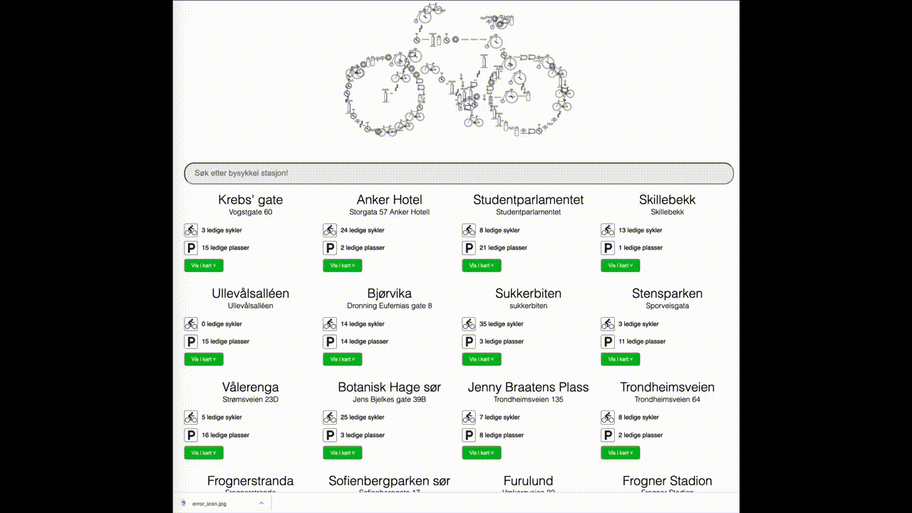

# Demo

En fungerende demonstrasjon av løsningen finnes her: [http://bysykkel.skeiene.no](http://bysykkel.skeiene.no). 

# Bysykkel

Denne webapplikasjonen er en enkel applikasjon som gjør det mulig å se alle bysykkel stasjonene med antall ledige sykler og parkeringsplasser/låser. Brukeren har mulighet til å søke (filtrere) ved å skrive inn navnet på en stasjon i søke-feltet på toppen av siden. Søket tar ikke hensyn til store og små bokstaver, og søkesetningen søker i hele ordet (ikke kun fra begynnelsen).

For å se hvor stasjonene befinner seg, er det mulig å åpne en liten kartvisning (som bruker Open Street Map). Fra kartet kan man også velge å åpne kartet i et eget vindu. 

Videoen under viser applikasjonen i bruk: 

Dersom noe går galt med henting av bysykkeldata, returnerer APIet en 500-feilkode til webapplikasjonen. Webapplikasjonen viser i så tilfelle en egen feilmeldingsside i stedet for stasjonssøket. 

# Implementasjon

Nettsiden består av to applikasjoner: 

- En Java backend, skrevet med rammeverket Spark
- En Webapplikasjon, skrevet i rammeverket Ember.js

## Backend

Backend er en liten Java-applikasjon som er bygget med Maven. Denne bruker Spark for å eksponere APIet. Spark er en enkel applikasjonsserver som gjør det enkelt å eksponere både statiske filer, og et API. Hele prosjektet består av kun 5 klasser: 

- no.bysykkel.stasjon.webserver.WebServer: Denne klassen har ansvaret for å sette opp webserveren og inneholder en enkel main() metode som starter applikasjonen. main() metoden har ansvaret for å sette opp logging (kun til konsollet i dette eksempelet), lese inn config.properties for å sette verdier applikasjonen trenger (kun filstien til webapplikasjonen i dette eksempelet), før den setter opp filstiene og lytter på kall til APIet på "/api/stations". Håndteringen av selve HTTP Request er delegert til klassen BysykkelHandler
- no.bysykkel.stasjon.webserver.BysykkkelHandler: Denne klassen har ansvaret for å håndtere innkommende HTTP requests til /api/stations. For å ikke hente data ved hver request, har denne klassen implementert en enkel caching av bysykkel stasjonsdata, som oppdateres hvert 10 minutt. Data fra APIene station_information og station_status er sammenstilt til ett API videre til webapplikasjonen. Dersom data ikke kan hentes, returneres det en HTTP 500 feilkode til webapplikasjonen. 
- no.bysykkel.stasjon.util.BysykkelJsonUtil: Denne klassen har ansvaret for å hente JSON fra en URL, parse denne og returnere det som et GSON objekt (JsonObject). 
- no.bysykkel.stasjon.model.*: Klassene inne i model-pakken er enkle POJO modeller for å lagre data inn og ut av APIene. 

Biblioteker: 

Applikasjonen benytter seg av følgende biblioteker: 

- sparkjava - En enkel å bruke applikasjonsserver for Java og Kotlin
- log4j - For logging
- Google GSON - Parsing av JSON tekst til objekter
- Hyrrokin (https://github.com/joachimhs/Hyrrokkin)

### Bygging av appliksjonen

Applikasjonen bygges ved hjelp av Maven via kommandoen: 

    mvn install

Applikasjonen bygges og resultatet legges i target-mappen som "stasjoner-0.1-jar-with-dependencies.jar"

NB: Prosjektet baserer seg på Hyrrokkin, som er et lite bibliotek som formaterer data til og fra formatet som Ember Data forventer på webapplikasjonen. Hyrrokkin er ikke publisert i et maven repo, og må dermed også bygges manuelt. Kildekoden til Hyrrokkin finnes på: https://github.com/joachimhs/Hyrrokkin

### Kjøring av applikasjonen

Sammen med "stasjoner-0.1-jar-with-dependencies.jar", må det også ligge en config.properties fil. Denne filen inneholder filstien til hvor applikasjonen kan finne koden til nettsiden. Filen config.properties kan enten ligge i samme mappe som JAR-filen, eller ett nivå opp. Dermed kan JAR-filen kjøres direkte fra target-mappen som Maven legger JAR-filen i. 

Når JAR filen er bygget og filstien i config.properties er bygget, kan applikasjonen enkelt kjøres ved hjelp av kommandoen: 

    java -jar stasjoner-0.1-jar-with-dependencies.jar

## Frontend

Frontend applikasjonen er bygget ved hjelp av Ember.js. Selv om Ember er litt i overkant for en såpass enkel løsning, får man likevel en god del funksjonalitet med som gjør at selve koden som er skrevet for nettsiden er relativt lite. Hoveddelen av koden ligger i controller/application.js, routes/application.js og i models/station.js. HTML koden ligger i templates/application.hbs og templates/application-error.hbs. 

- routes/application.js: Her ligger koden som henter data fra APIet. Denne hentes i model()-funksjonen via Ember Data
- controllers/application.js: Denne filen har ansvaret for å filtrere bysykkelstasjoner basert på det brukeren skriver i søkefeltet, samt å vise og skjule kartet
- model/station.js: Dette er modellen, og har også ansvaret for å generere URLene til Open Street Map
- adapters/application.js og serializers/application.js: Disse har ansvaret for å bestemme hvordan data fra APIet skal parses og URLen data hentes fra. 
- templates/application.hbs: Dette er HTML-koden (Handlebars) for hele nettsiden. Denne setter opp søkefeltet og legger ut alle stasjonene som skal vises på skjermen. Alle bruker-hendelser er videresendt til kontrolleren via actions. 
- templates/application-error.hbs: Ember videresender automatisk til dette templatet dersom den ikke klarer å hente data (f.eks. når den mottar en HTTP 500 feilkode)

### Grafikk

Alle grafikk-filer brukt i denne applikasjonen er hentet Pixabay.

### Bygging

For å bygge frontend applikasjonen må Ember CLI installeres fra [https://ember-cli.com](https://ember-cli.com). 

Første gang applikasjonen bygges må dependencies hentes fra NPM: 

    npm install

Deretter kan applikasjonen bygges via 

    ember builld

De ferdig bygde filene plasseres da i mappen /dist. Filstien til denne kan inkluderes direkte i config.properties når applikasjonen skal startes.

### Ferdig bygget
I dette repositoryet er den ferdig-bygde web-applikasjonen lagt ved allerede i dist-mappen. Dette er gjordt for å gjøre det litt enklere å få applikasjonen opp. Normalt ville dist-mappen ligget i .gitignore. 
